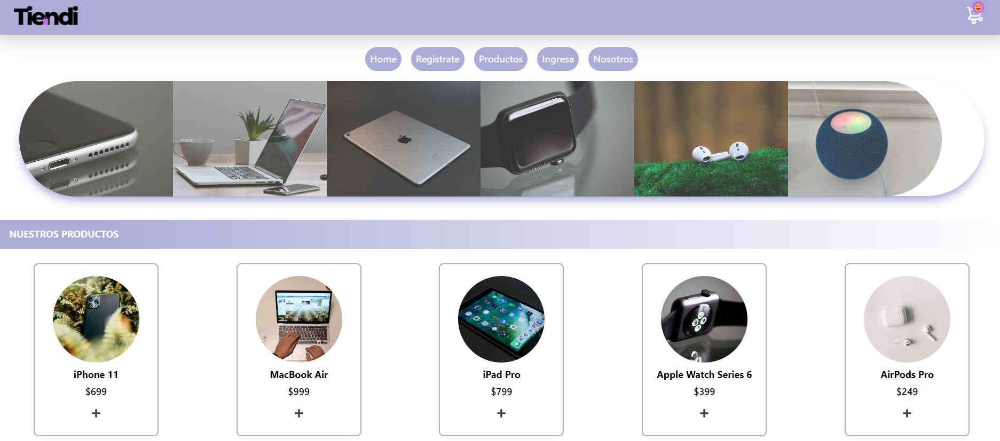

In this Tiendi project, I used technologies such as Javascript, NextJS, Typescript, Tailwind, PostgreSQL, and more. Tiendi aims to sell computer products, where users can make purchases and receive an order with a specific date, ID, time, and other details.

The site is not deployed yet because I want to implement testing first. However, you can access the content on my GitHub by running npm start in the backend and npm run build in the frontend.

