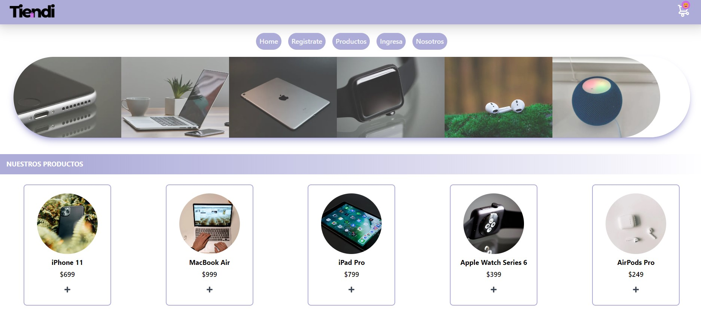

## Tiendi Project

In this Tiendi project, I used technologies such as Javascript, NextJS, Typescript, Tailwind, PostgreSQL, and more. Tiendi aims to sell computer products, where users can make purchases and receive an order with a specific date, ID, time, and other details.

I designed Tiendi to be responsive, ensuring it works perfectly on mobile phones, tablets, and desktop computers. One unique feature of NextJS is its server-side rendering, which makes it ideal for e-commerce websites due to improved performance and SEO benefits.

Additionally, I developed key skills in using Figma for design purposes. This project is part of my specialization in Frontend development, as required by the curriculum of the school where I studied. The site is not deployed yet because I want to implement Testing first, as I want to use it to make the project even more complete.
